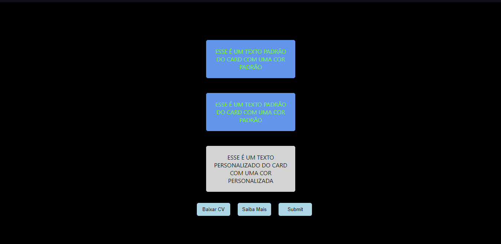
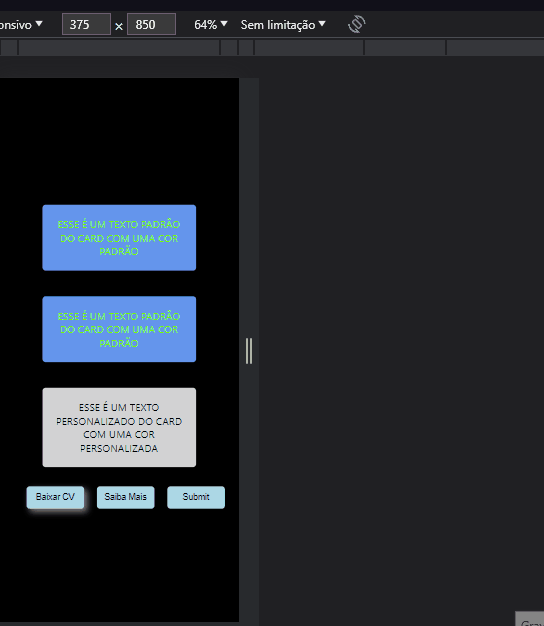
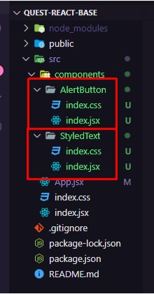
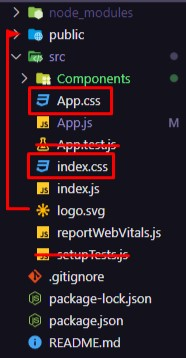
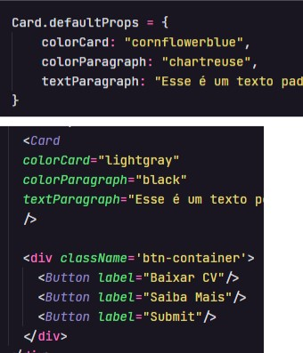
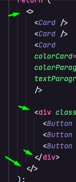
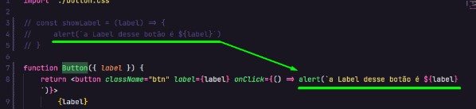

<h1 align="center">Desafio React Básico</h1>
<br>

<p align="center">4° Desafio do curso com Feedback</p> 
<br>

<div>
    <h3 align="center"><strong>Desktop View</strong><h3>
    <a href="https://thaleshng.github.io/quest-react-base/" target="_blank"></a> 
</div>

<div align="center">
    <h3 align="center"><strong>Mobile View</strong><h3>
    <a href="https://thaleshng.github.io/quest-react-base/" target="_blank"></a> 
</div>

<div align="center">
    
    
    
    <br>
    
    <br>
    
    <br>
    
</div>

<br>


<div align="center">
    <a href="#tecnologias-utilizadas">Tecnologias Utilizadas</a> •
    <a href="#finalidade-do-projeto">Finalidade do Projeto</a> •
    <a href="#feedback">Feedback</a> •
    <a href="#dificuldades-encontradas-e-aprendizados">Dificuldades Encontradas e Aprendizados</a> •
    <a href="#como-ter-acesso-ao-código">Como ter acesso ao Código</a>
</div>

<br>
<br>

<h2 align="center">Tecnologias Utilizadas</h2>
<br>

[](https://www.devmedia.com.br/o-que-e-o-html5/25820)
<br>
<br>

[](https://kenzie.com.br/blog/css3/)
<br>
<br>

[](https://blog.betrybe.com/javascript/)
<br>
<br>

[](https://react.dev)

<br>

<h2 align="center">Finalidade do Projeto</h2>
<br>

<p> O projeto em questão tem como finalidade testar os aprendizados do módulo de React Básico do curso de developer.</p> 
<p>A premissa do desafio em questão foi avaliar como o aluno do curso criaria através de componentes, uma componente que colore e transforma um texto para maiúsculo (uppercase) utilizando JS e outra que deve mostrar mensagem com a label do botão, fazendo uso de props e Style Inline para modificar os estilos.
<p>Finalizado o projeto, os professores do curso dariam um feedback do código, para testar o nível de aprendizado de cada aluno e corrigir o código para que os alunos possam melhorar suas maneiras de codar.
</p> 
<br>
<br>
<br>
<br>

<h2 align="center">Feedback</h2>
<br>

<h3 align="center">"Correção de Quest:
JavaScript Intermediário
</h3>
<br>
<p align="center">Aluno: Thales Henrique - Turma 11<br>
<a href="https://github.com/thaleshng/quest-js-intermediario">https://github.com/thaleshng/quest-js-intermediario</a></p>

<h3>Requisitos Obrigatórios:</h3>

<ul>
    <li>Bom nome pro componente.</li>
    <li><s>Style Inline para modificar os estilos.</s></li>
    <li><s>Props pra passar o texto e sua cor para o componente.</s></li>
    <li><s>Componente renderizado na tela com um parágrafo colorido e com todas as letras maiúsculas usando JS</s></li>
    <li><s>Componente Button com um evento de clique que apresente um alerta informando a prop label do botão que foi clicado, com a seguinte mensagem: "A label desse botão é <'insira a label aqui via JS'>".</s></li>
    <p style=color:#C5C5C5> Exemplo: Com um botão com essa label:
    <'Button label="Baixar CV' />
    Ao clicar no botão deve mostrar um alert com a mensagem "A label desse botão é Baixar CV".
</p>
</ul>

<h3>Pontuações:</h3>
<ol>
    <li>Atenta pros nomes dos seus componentes. O seu componente ‘Button’, por exemplo, tem uma função específica de disparar um alerta com uma mensagem de texto, isso faz com que ele seja “único” no projeto. Componentes únicos, mais “específicos”, devem ter nomes que deixem claro suas funcionalidades.
	Ex: AlertButton.js</li><br>
    <li>Uma recomendação de estrutura pros seus componentes é a seguinte: <br><br>
    <br><br>
    Cada componente terá sua própria pasta, como o componente AlertButton e o StyledText (StyledText seria uma outra ideia de nome semântico pro seu componente). Sabendo disso, o arquivo que vai conter o código JSX do seu componente deve ter o nome <strong>index.js</strong> como mostrado no exemplo. O arquivo de estilo também pode ser chamado de index.css, fazendo referência aos estilos daquele componente. Caso um dos seus componentes precise de mais de um arquivo CSS, não poderia repetir o nome ‘index.css’, atenta pra isso.<br><br>
    O motivo de ser chamado <strong>index.js</strong> é por pura convenção, deixa o componente organizado e melhora a leitura das próximas pessoas que forem olhar teu projeto. Além disso, também diminui e organiza o tamanho das importações e exportações de componentes e páginas dentro do projeto (ou seja, só vantagens).
    </li><br>
    <li>Três pontos importantes:<br><br>
    <br><br>
    a. O Create-React-App, por padrão, deixa alguns arquivos à mais no teu código (esses riscados). Como não faz parte dessa Quest, não são utilizados, e como não são utilizados, tu pode remover do código, deixando o projeto mais leve pro usuário baixar.
    <br>
    b. Os arquivos App.css e index.css (dentro das caixinhas vermelhas) estão tendo o mesmo propósito nesse projeto, os dois estão servindo como CSS global. Tu poderia escolher um dos dois e definir os estilos globais dentro dele.
    <br>
    c. Por convenção, arquivos de imagens são sempre colocados dentro de uma pasta assets (que fica dentro de src) ou dentro da pasta public.
    </li><br>
    <li>Bom uso das <strong>Default.Props</strong> e da <strong>Props.Label</strong> no seu componente:<br><br>
    <br><br>
    Cumpriu exatamente o que foi pedido na Quest. 👏🏻
    </li><br>
    <li>Levando em conta que tem apenas um elemento dentro do <strong>return, foi ótimo</strong> ter simplificado os seus componentes:<br><br>
    <br><br>
    Pode fazer isso sempre que o componente retornar <strong>apenas um único elemento filho no primeiro nível.</strong>
    </li><br>
    <li>Aqui poderia ter feito uso do fragment no seu projeto:<br><br>
    <br><br>
    O Fragment é uma ferramenta muito útil para evitar a criação de elementos desnecessários e manter a estrutura do código mais limpa,  é especialmente útil quando há <strong>mais de um elemento</strong> pra ser renderizado.
    </li><br>
    <li>O style inline foi feito corretamente, mandou bem. 
    </li><br>
    <li>Apesar do Desafio-02 ter sido cumprido, há formas mais eficazes de fazê-lo:<br><br>
    <br><br>
    A linha 3, 4 e 5 foram comentadas, no entanto, o componente de alerta continua com o mesmo comportamento, funcionando igual.
    <br><br>
    A função de alerta pode ser feita dentro da Arrow  Function do ‘onClick’, como mostrado acima.
    Dessa forma, teria o mesmo resultado mas sem a necessidade de criar uma variável apenas para armazenar o texto, deixando o código mais legível e resumido.
    <br><br>
    <strong>OBS:</strong> Lembra de usar Arrow Function dentro do OnClick e que, <strong>se existirem apenas para chamar uma única função,</strong> as chaves são opcionais.
    </li><br>
</ol>
<br>
<p>No fim, completou os dois desafios de React Básico, tá mandando bem!
<br>
Anota essas observações, se preferir, e vai treinando tudo isso. Usa essas mesmas observações nos próximos projetos que vão te ajudar bastante.
Como desafio final, tenta refatorar esse teu código usando essas dicas, com a prática você pega o jeito da coisa. 

 
</p>

<h3>~ Boa sorte, Thales! ☕"</h3>
<br>
<br>
<br>
<br>

<h2 align="center">Dificuldades Encontradas e Aprendizados</h2>
<br>

<p> No geral não encontrei tantas dificuldades no desenvolvimento do projeto, porém, acabei deixando passar algumas refatorações pontuais no projeto, além de deixar de completar um dos objetivos que é dar bons nomes para os componentes.</p>
<p> Aprendi a criar melhor os componentes do React e após o feecback me atentei melhor à questão de dar nomes mais legíveis e compreensíveis para as próximas manutenções no projeto, além de me atentar também para refatorações que poderiam ser feitas para diminuir o código e deixá-lo mais enxuto, outro ponto imporante sobre deixar o projeto mais enxuto também é sobre excluir arquivos não utilizados que vem por padrão ao usar o Create React APP.</p>
<p>Após receber o Feedback, busquei refatorar o código seguindo as pontuações que foram passadas no mesmo, acredito ter conseguido um bom resultado.</p>
<br>
<br>
<br>
<br>

<h2 align="center">Como ter acesso ao Código<h2>
<br>

### Pré-requisitos:
<br>
Antes de começar, vai precisar ter instalado na sua máquina as seguintes ferramentas:
<br>
<br>

[Git Bash](https://git-scm.com)

[VS Code](https://code.visualstudio.com)

[Node.js](https://nodejs.org/pt-br)
<br>
<br>

Clone este repositório com o Git Bash:
```
git clone https://github.com/thaleshng/quest-js-intermediario.git
```
Entra na pasta que foi criada e abra com o Git Bash e use o seguinte comando para baixar e instalar os pacotes npm e suas dependências:

```
npm install
```
Ao terminar de baixar e instalar os pacotes (note se foi baixada a pasta node-modules), use o comando para iniciar o projeto na máquina local:

```
npm start
```
